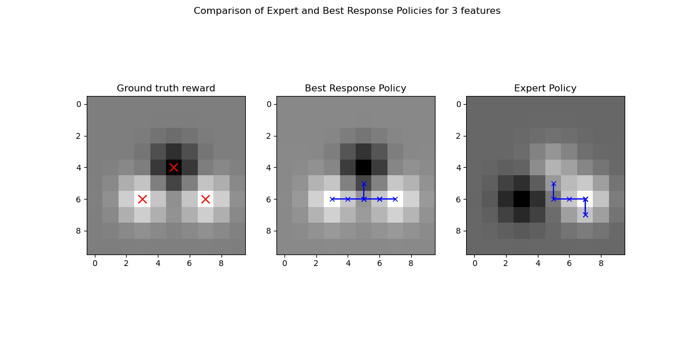
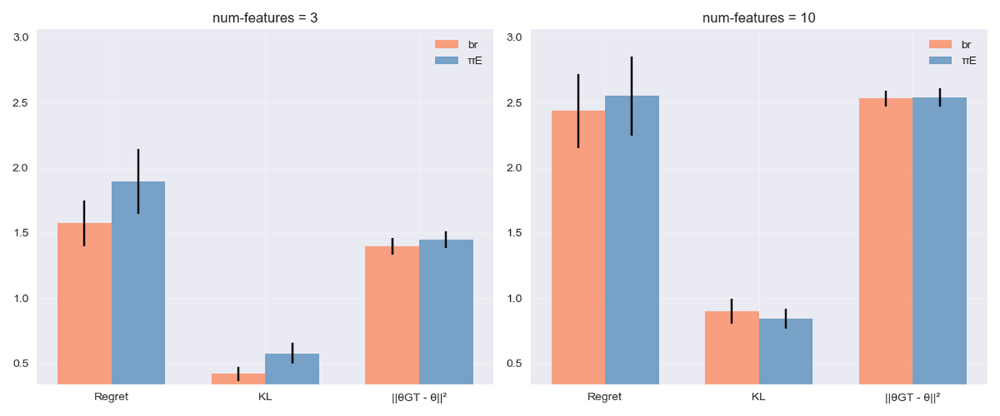

## Cooperative Inverse Reinforcement Learning

This repository, part of the work for Ecole Polytechnique's **Collaborative and Reliable Learning** class, aims at studying Cooperative Inverse Reinforcement Learning (CIRL). 

It proposes a first implementation based on **[Cooperative Inverse Reinforcement Learning (Hadfield-Menell et. al.) (Neurips 2016)](https://papers.nips.cc/paper_files/paper/2016/hash/c3395dd46c34fa7fd8d729d8cf88b7a8-Abstract.html)** reproducing its turn based apprenticeship-learning framework and results on a robot gridworld. 

Leveraging the results from **[An Efficient, Generalized Bellman Update For Cooperative Inverse Reinforcement Learning (Malik et. al. (ICML 2018))](https://arxiv.org/pdf/1806.03820)**, we implement the general improved method for any CIRL game and adapt their ChefWorld example to the robot gridworld for comparison, showing true CIRL. 

## CIRL

Leveraging a heuristic taking into account the minimizing of feature count dissimilarity. We can generate more instructive demonstrations. 

  

*Figure 1: Comparison of ground truth reward with the infered reward from the robot for each trajectory (best response vs expert). The trajectories are in blue.*

  

*Figure 2: Analysis of regret, KL divergence and L2 norm of theta for the best response and expert behaviours*

### How to run ? 

In the `apprenticeship_learning` directory.

Run the `run_test.py` file.  

Results are saved in the `results_path` directory. The number of total trials `n_trials` as well as the size of the grid `grid_size` and the length of the total trajectory for human and robot `horizon`. A horizon of more than `8` makes running very slow. 

### CIRL code structure

- `gridworld.py` : grid where robot and human move, with the different feature centers
- `robot.py` : implements the robot behaviour
    - learning theta through maximum entropy IRL, with an implementation based on [a project by Maximilian Luz](https://nbviewer.org/github/qzed/irl-maxent/blob/master/notebooks/maxent.ipynb)
    - calls `Valueiterationplanner.py` for the greedy maximization policy.

- `human.py` : implements the demonstration trajectories and policies. The heuristic is implemented. 

## True CIRL with Efficient Bellman update

Implementing the general efficient bellman update framework which can be applied to any CIRL game. Makes CIRL truly turn based at each step. 

